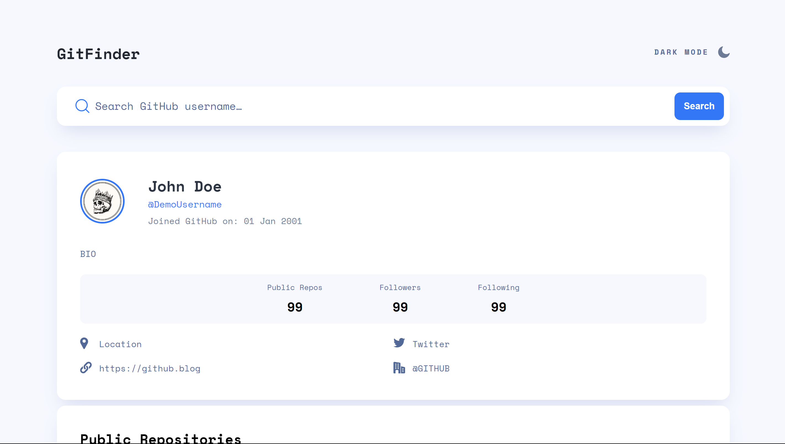

# GitHub User Finder

Design a website that displays the public Github repositories belonging to any specific user.

## References & Requirements

- API Documentation https://docs.github.com/en/rest/reference
- Pagination has to be `server`-side
  - By default, show `10` repositories per page
  - User should be able to choose a maximum of `100` repositories per page.
- When the API calls are in progress, consider showing loaders.
- Optionally, you can provide a search bar to filter the repositories.

## Solution

- The assignment is done in only HTML, CSS and Javascript.
- I have used the following Github API's to do the required task:
  - `https://api.github.com/users/${USER}`
  - `https://api.github.com/users/${USER}/repos?per_page=${repoPerPage}&page=${currentPage}`
- I have designed a beautiful single page interface.
- Instead of adding new pages for showing repos, I added a `Load More` button that user can use to get hidden repos.
- This website also supports both `Light` and `Dark` themes.
- This website is fully responsive for all screen sizes.

## Demo




## Building the project

Clone the Repository:

```bash
git clone git@github.com:HarshTondak/GitFinder.git
```

## Deployment

Github Repository: [git](https://github.com/HarshTondak/GitFinder)

This website is hosted using: [Netlify](https://www.netlify.com/)

Hosted Website link is: [GitFinder](https://gitprobe.netlify.app/)

**Have fun building!** 🚀
